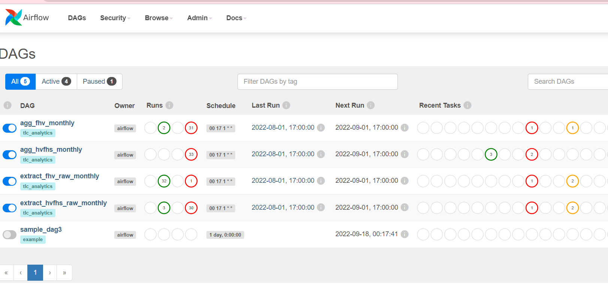

# tlc_pipeline_analytics
## About the project

This repository is an example of very simple batch data pipeline using Spark and Airflow. The flow of pipeline can be seen as diagram below:

We use raw data from NYC TLC to be ingested. You can follow this [link](https://www1.nyc.gov/site/tlc/about/tlc-trip-record-data.page) to see more detail. The raw data will then be stored on top of HDFS which can be accessed using Spark via Hive. Spark will then do simple transformation and persist data into Postgres.

Airflow will be used as workflow orchestration to schedule the job monthly, which will be done at the end of every month. All of these will be then processed on top of a GCP VM.

Since the purpose of this repo is to only show an example of how the usage of these stacks, then the we only use simple pipeline and transformation. In the real world, it is very possible that the process will be much more complicated than this one. 

## Getting started

These are prerequisites that must be done before start the project:

1. Setup a GCP VM
2. Install Spark
3. Install Postgres docker
4. Install HDFS
5. Install Airflow

## Usage

1. Start Postgres docker, HDFS, Airflow webserver and scheduler
2. Make directory on Hadoop using <code> hdfs dfs -mkdir -p /data/tlc_analytics/staging/ </code>
3. Create Postgres database and table using <code> create_db_table.sql </code>
4. Go to Airflow console at <VM IP>:8080, add variable user according to your user GCP
5. Start Airflow dag as below: 
